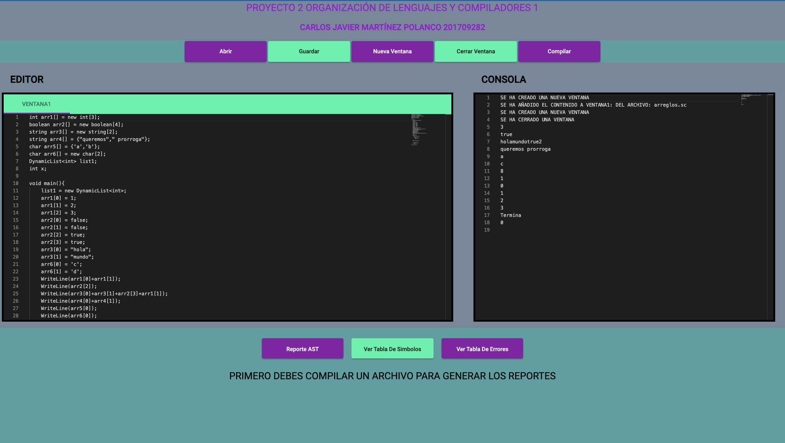

# Proyecto2_OLC1_201709282

<br>

## **GRAMATICA SC**
<hr>

<br>

<p style="text-align:justify">
El lenguaje sc esta basado en java y javascript, tiene una gramática optimizada con todas las funcionalidades de javascript en cuanto a la capacidad de generar e interpretar expresiones y sentencias. Entre las expresiones podemos encontrar las diferentes operaciones (aritméticas, lógicas, relacionales y ternarios) que nos proporcionan un valor de retorno. El lenguaje es capaz de reconocer la declaración, asignación o inicializacion de valores en variables. Como estructuras de datos dinámicas, contamos con la declaración, asignación e inicialización de listas dinamicas, ademas del funcionamiento de estas listas por medio de funciones nativas para setear un valor en la lista, devolver un valor en la lista y agregar un valor del mismo tipo de dato en la lista. Para el almacenamiento statico el lenguaje es capaz de reconocer los Arrays, estos se deben declarar e inicializar con un tamaño definido y su tipo de dato, existe una segunda manera de inicializar un arreglo utilizando las llaves y enlistando valores del mismo tipo dentro de ellas separados por comas, los Arrays al ser una estructura estatica se accende a los valores por medio de una sentencia que permite escribir el indice del valor deseado ya sea para asignar un valor o retornarlo. El lenguaje sc, cuenta con la mayoria de ciclos y sentencias condicionales que java y javascript como: While, Do While, Switch, if, else, else if y for. Estos pueden ser controlados con las sentencias de transferencia break, continue y return.  Para el manejo de funciones se pueden hacer declaraciones de funciones sin retorno que serán de tipo void, las funciones declaradas de cualquiera de los demas tipos de dato deberán retornar un valor de ese tipo. Adicionalmente el lenguaje cuenta con funciones nativas para realizar cambios en los tipos de datos de nuestros dato como algunos casteos implícitos. Tenemos los casteos explícitos, los cuales actualizan el tipo de dato de nuestros datos y se lo asignamos a una nueva variable declarada con el tipo de dato que se requiere. Para inicializar el sistema se utiliza la sentencia start with, la cual nos indica cual es la funcion principal de nuestro programa.
</p>

<br>

````
INICIO
    :ENTORNO_GLOBAL EOF 

//LISTA DE INSTRUCCIONES EN EL ENTORNO GLOBAL QUE EJECUTARA EL PROGRAMA
ENTORNO_GLOBAL
    :ENTORNO_GLOBAL GLOBAL 
    |GLOBAL
    |error

//INSTRUCCIONES GLOBALES
GLOBAL    
    :DECLARACION_VARIABLE
    |DECLARACION_FUNCIONES
    |INICIAR_SISTEMA

//DECLARAR EL INICIO DEL SISTEMA
INICIAR_SISTEMA
    :'start' 'with' 'id' '(' ')' ';'
    |'start' 'with' 'id' '(' LISTA_VALORES ')' ';'

//LISTA DE VALORES PARA INGRESAR LOS PARAMETROS DE FUNCIONES Y METODOS PARA INICIAR EL SISTEMA
LISTA_VALORES
    :LISTA_VALORES ',' EXPRESION
    |EXPRESION


//DECLARACION DE FUNCIONES O METODOS
DECLARACION_FUNCIONES
    :TIPO_DATO 'id' '(' PARAMETROS_FUNCION ')' ENTORNO
    |TIPO_DATO 'id' '(' ')' ENTORNO
    |PARAMETROS_FUNCION ',' 'lista_dinamica' '<' TIPO_DATO '>' 'id'
    |'lista_dinamica' '<' TIPO_DATO '>' 'id'
    |PARAMETROS_FUNCION ',' TIPO_DATO 'id' '[' ']'
    |TIPO_DATO 'id' '[' ']'
    |TIPO_DATO 'id'


//LISTA DE INSTRUCCIONES
INSTRUCCIONES
    :INSTRUCCIONES INSTRUCCION
    |INSTRUCCION

//INSTRUCCIONES QUE INGRESARAN EN UNA LISTA
INSTRUCCION
    :DECLARACION_VARIABLE
    |ASIGNACION ';'
    |METODOS_CALL ';'
    |SENTENCIAS
    |TRANSFERENCIA ';'

//SENTENCIAS DE TRANSFERENCIA
TRANSFERENCIA   
    :'break'
    |'return' EXPRESION
    |'return'
    |'continue'

//SENTENCIAS (CICLOS Y CONDICIONES) A UTILIZAR EN EL LENGUAJE
SENTENCIAS
    :GENERARIF
    |GENERARSWITCH
    |GENERARWHILE
    |GENERARFOR
    |GENERARDOWHILE
   
//SENTENCIA PARA EL CICLO IF Y TODAS SUS VARIANTES
GENERARIF
    :'if' '(' EXPRESION ')' ENTORNO GENERARELSE
    

//SENTENCIA PARA ELSE
GENERARELSE
    :'else' ENTORNO
    |'else' GENERARIF
    |/*epsilon*/

//SENTENCIA PARA SWITCH
GENERARSWITCH
    :'switch' '(' EXPRESION ')' ENTORNO_SWITCH

//LISTA DE CASOS DEL SWITCH
CASES_LIST
    :CASES_LIST 'case' EXPRESION ':' INSTRUCCIONES
    |'case' EXPRESION ':' INSTRUCCIONES

//DEFAULT PARA EL SWITCH
DEFAULT
    :'default' ':' INSTRUCCIONES
    

//SENTENCIA PARA WHILE
GENERARWHILE
    :'while' '(' EXPRESION ')' ENTORNO

//SENTENCIA PARA FOR
GENERARFOR
    :'for' '(' DECLARACION_VARIABLE EXPRESION ';' ASIGNACION ')' ENTORNO
    |'for' '(' ASIGNACION ';' EXPRESION ';' ASIGNACION ')' ENTORNO
    ;

//SENTENCIA PARA DO WHILE
GENERARDOWHILE
    :'do' ENTORNO 'while' '(' EXPRESION ')' ';'
    ;

//ENTORNO PARA EL SWITCH
ENTORNO_SWITCH
    :'{' CASES_LIST DEFAULT '}
    |'{' CASES_LIST '}'
    |'{' DEFAULT '}'
//ENTORNO PARA EL ENCAPSULAMIENTO DE INSTRUCCIONES EN DIFERENTES AMBITOS
ENTORNO
    :'{' '}'
    |'{' INSTRUCCIONES '}'
    ;

//LLAMADA A LOS METODOS
METODOS_CALL
    :'append' '(' 'id' ',' EXPRESION ')'
    |'setValue' '(' 'id' ',' LISTA_VALORES ')'
    |'WriteLine' '(' LISTA_VALORES ')'
    |'id' '(' LISTA_VALORES ')'
    |'id' '(' ')'
    ;

//LLAMADA DE FUNCIONES
FUNCIONES_CALL   
    :'getValue' '(' 'id' ',' LISTA_VALORES ')'
    |'toLower' '(' LISTA_VALORES ')'
    |'toUpper' '(' LISTA_VALORES ')'
    |'length' '(' LISTA_VALORES ')'
    |'truncate' '(' LISTA_VALORES ')'
    |'round' '(' LISTA_VALORES ')'
    |'typeof' '(' LISTA_VALORES ')'
    |'tostring' '(' LISTA_VALORES ')'
    |'toCharArray' '(' LISTA_VALORES ')'
    |'id' '(' LISTA_VALORES ')'
    |'id' '(' ')'
    ;


//DECLARACION DE VARIABLE
DECLARACION_VARIABLE
    :TIPO_DATO ASIGNACION 
    |TIPO_DATO LISTA_ID';'
    |TIPO_DATO LISTA_ID '[' ']' ';'
    |'lista_dinamica' '<' TIPO_DATO '>' ASIGNACION ';'
    |'lista_dinamica' '<' TIPO_DATO '>' LISTA_ID ';'


//ASIGNACION DE VARIABLES
ASIGNACION
    :LISTA_ID '=' EXPRESION
    |LISTA_ID '[' ']' '=' EXPRESION
    |LISTA_ID '[' EXPRESION ']' '=' EXPRESION
    |LISTA_ID '[' '[' EXPRESION ']' ']' '=' EXPRESION
    |'id' '++'
    |'id' '--'

//LISTA DE ID
LISTA_ID
    :LISTA_ID ',' 'id'
    |'id'

//TIPOS DE DATO
TIPO_DATO
    :'t_double'
    |'t_char'
    |'t_int'
    |'t_string'
    |'t_boolean'
    |'void'

//EXPRESIONES
EXPRESION
    :EXPMAT
    |EXPLOG
    |EXPREL
    |EXPTER
    |FUNCIONES_CALL
    |'(' TIPO_DATO ')' EXPRESION
    |ARRAY
    |VALORES
    |'id'
    |'id' '++'
    |'id' '--'

//EXPRESIONES PARA DAR EL VALOR DEL ARRAY
ARRAY
    :'{' VALORES_LIST '}'
    |'new' TIPO_DATO '[' EXPRESION ']'
    |'id' '[' EXPRESION ']

//EXPRESIONES ARITMETICAS
EXPMAT
    :EXPRESION '+' EXPRESION
    |EXPRESION '-' EXPRESION
    |EXPRESION '/' EXPRESION
    |EXPRESION '*' EXPRESION
    |EXPRESION 'ˆ' EXPRESION
    |EXPRESION '%' EXPRESION
    |'-' EXPRESION 

//EXPRESIONES LOGICAS
EXPLOG
    :EXPRESION '&&' EXPRESION
    |EXPRESION '||' EXPRESION
    |'!' EXPRESION

//EXPRESIONES RELACIONALES
EXPREL
    :EXPRESION '==' EXPRESION
    |EXPRESION '!=' EXPRESION
    |EXPRESION '<' EXPRESION
    |EXPRESION '<=' EXPRESION
    |EXPRESION '>' EXPRESION
    |EXPRESION '>=' EXPRESION

//EXPRESION PARA OPERADOR TERNARIO
EXPTER  
    :EXPRESION '?' EXPRESION ':' EXPRESION


//LISTA DE LITERALES
VALORES_LIST
    :VALORES_LIST ',' VALORES
    |VALORES

//LITERALES
VALORES
    :'int'
    |'double'
    |'boolean'
    |'char'
    |'string'


````


<br>

## **MANUAL TÉCNICO**
<hr>
<p style="text-align:justify">
Se utilizó el patron de diseño "INTERPRETE" para el desarrollo del interprete con la herramienta JISON, la cual genera un árbol de sintaxis que al recorrerlo y ejecutar las funciones abstractas que por medio de la herencia le asignamos a las clases, se le da funcionalidad al codo ingresado.
</p>
<br>
<h3>FRONTEND: </h3> 
<br>
<ul>
    <li>
    Framework:
        <ul>
            <li>
                Angular v12
            </li>    
        </ul>
    </li>
    <li>
    Lenguajes:
        <ul>
            <li>
                HTML
            </li>
            <li>
                Typescript/Javascript
            </li>
            <li>
                CSS
            </li>    
        </ul>
    </li>
    <li>
        Modulos:
        <ul>
            <li>
                Angular Material
            </li>
            <li>
                graphviz-D3
            </li>
            <li>
                HttpClient
            </li>
            <li>
                Router
            </li>
            <li>
                Monaco editor (editor de texto)
            </li>
        </ul>
    </li> 
</ul> 
<br>  
<h3>BACKEND: </h3>
<br>
<ul>
    <li>
    Framework:
        <ul>
            <li>
                Nodejs v14.17.3
            </li>
            <li>
                Express js (para el server)
            </li>     
        </ul>
    </li>
    <li>
    Lenguajes:
        <ul>
            <li>
                Typescript/Javascript
            </li> 
            <li>
                Dot (graphviz)
            </li>  
        </ul>
    </li>
    <li>
    Modulos:
        <ul>
            <li>
            JISON (interprete)
            </li>        
        </ul>
    </li> 
</ul>   
<br>
<p style="text-align:justify">
Adicionalmente se utilizó la herramienta Docker para crear dos contenedores, uno para el cliente y otro para el servidor.
</p>
<br>
<h3 style="text-align:center">DIAGRAMA DE CLASES</h3>
<br>


<br>

## **MANUAL DE USUARIO**

<hr>
<br>
<h3 style="text-align:center"> INTRODUCCION </h3>

<p style="text-align:justify">
El siguiente proyecto es un interprete con la herramienta JISON de un lenguaje similar a javascript, se realiza una arquitectura cliente-servidor. Para el cliente se utilizó el framework Angular para desarrollo web, el cual esta basado en el lenguaje typescript. Para el server se utilizó Nodejs y typescript, el cual es un lenguaje que se transpila a javascript. Adicionalemtente el proyecto esta almacenado en un contenedor en Docker para cada parte de la arquitectura y por medio de Dockerhub se puede descargar la imagen y poder ejecutar el programa en cualquier sistema operativo sin necesidad de instalar todos los modulos o dependencias necesarias para su funcionamiento.
</p>
<br>
<h3 style="text-align:center">INTERFAZ GRÁFICA</h3>
<br>
<p style="text-align:justify">
La interfaz simula un entorno de desarrollo para el aprendizaje de programación y como estan estructurados los diferentes lenguajes a través de un interprete. La interfaz cuenta con un editor de código para ingresar los comando con el lenguaje establecido y una consola que muestra los mensajes de errores y la ejecución del código. También cuenta con la opcion de agregar ventanas, cerrar ventanas, abrir archivos con la extención .sc y tambien puede generar y guardar un archivo .sc con el contenido de la ventana seleccionada. Adicionalmente el proyecto es capaz de generar el árbol de sintaxis, tabla de símbolos y tabla de errores. Los cuales se generan luego de compilar el código y navegar con los botones que se muestran en la parte inferior de la página principal. 
<p>

##### **PAGINA DE INICIO**

<br>

##### **AGREGAR VENTANA**

<br>

##### **CERRAR VENTANA**

<br>

##### **ABRIR**

<br>

##### **ARCHIVO ABIERTO**

<br>


##### **GUARDAR**

<br>

##### **COMPILAR**

<br>

##### **REPORTE AST**

<br>

##### **VER TABLA DE SÍMBOLOS**

<br>

##### **VER TABLA DE ERRORES**

<br>
<hr>
<br>
<h3 style="text-align:center">CODIGOS DE EJEMPLO</h3>
<br>

##### **EXPRESIONES:**

````
int val1 = 5;
int val2 = 5;
int suma(int par1, int par2){
    int resultado = par1 + par2;
    return resultado;
}

int resta(int par1, int par2){
    int resultado = par1 - par2;
    return resultado;
}

int multiplicacion(int par1, int par2){
    int resultado = par1 * par2;
    return resultado;
}

int division(int par1, int par2){
    int resultado = (int)(par1 / par2);
    return resultado;
}

int potencia(int par1, int par2){
    int resultado = par1 ˆ par2;
    return resultado;
}

int modulo(int par1, int par2){
    int resultado = (int)(par1 % par2);
    return resultado;
}

void main(){
    int opcion = 1;
    if(opcion == 1){
        WriteLine(toString(suma(val1, val2)));
    }else if(opcion == 2){
        WriteLine(toString(resta(val1,val2)));
    }else if(opcion == 3){
        WriteLine(toString(multiplicacion(val1,val2)));
    }else if(opcion == 4){
        WriteLine(toString(division(val1,val2)));
    }else if(opcion == 5){
        WriteLine(toString(potencia(val1,val2)));
    }else{
        WriteLine(toString(modulo(val1,val2)));
    }
}

start with main();
````
<br>
<hr>
<br>

##### **CASTEOS:**

````
int x = 70;
char z = 'a';
double q = 5.5;
string p = "HoLa MuNdO";

void main(){
    //PASAR DE INT A DOUBLE
    double decimal = (double)x;
    WriteLine(decimal); 

    //PASAR DE DOUBLE A INT
    int entero = (int)q;
    WriteLine(entero);

    //PASAR DE INT A STRING
    string cadena = toString(x);
    WriteLine(cadena); 

    //PASAR DE INT A CHAR
    char letra = (char)x;
    WriteLine(letra); 

    //PASAR DE DOUBLE A STRING
    string cadena2 = toString(q);
    WriteLine(cadena2);

    //PASAR DE CHAR A INT
    int caracter = (int)z;
    WriteLine(caracter);  

    //PASAR DE CHAR A DOUBLE
    double caracter2 = (double)z;
    WriteLine(caracter2);

    //FUNCION LENGTH CON CADENA DE TEXTO
    WriteLine(Length(p));

    //FUNCION ROUND
    WriteLine(round(q));

    //FUNCION TOCHARARRAY
    WriteLine(toCharArray(p));

    //FUNCION TOLOWER
    WriteLine(toLower(p));

    //FUNCION TOUPPER
    WriteLine(toUpper(p));

    //FUNCION TRUNCATE
    WriteLine(truncate(q));

    //FUNCION TYPEOF
    WriteLine(TypeOf(x));
    WriteLine(TypeOf(z));
    WriteLine(TypeOf(p));
    WriteLine(TypeOf(q));
}

start with main();
````

<br>
<hr>
<br>

##### **SWITCH:**

````
int opciones = 3;

void menu(){
    switch(opciones){
        case 1:
            WriteLine("OPCION1");
            break;
        case 2:
            WriteLine("OPCION2");
            break;
        case 3:
            WriteLine("OPCION3");
            break;
        default:
            WriteLine("OPCION DEFAULT");
            break;
    }
}

void main(){
    menu();
    WriteLine("listo");
}

start with main();
````

<br>
<hr>
<br>

##### **ESTRUCTURAS DE DATOS Y CICLOS:**

````
int arr1[] = new int[3];
boolean arr2[] = new boolean[4];
string arr3[] = new string[2];
string arr4[] = {"queremos"," prorroga"};
char arr5[] = {'a','b'};
char arr6[] = new char[2];
DynamicList<int> list1;
int x;

void main(){
    list1 = new DynamicList<int>;
    arr1[0] = 1;
    arr1[1] = 2;
    arr1[2] = 3;
    arr2[0] = false;
    arr2[1] = false;
    arr2[2] = true;
    arr2[3] = true;
    arr3[0] = "hola";
    arr3[1] = "mundo";
    arr6[0] = 'c';
    arr6[1] = 'd';
    WriteLine(arr1[0]+arr1[1]);
    WriteLine(arr2[2]);
    WriteLine(arr3[0]+arr3[1]+arr2[3]+arr1[1]);
    WriteLine(arr4[0]+arr4[1]);
    WriteLine(arr5[0]);
    WriteLine(arr6[0]);
    append(list1,3);
    append(list1,5);
    setValue(list1, 3,1);
    WriteLine(getValue(list1,0)+getValue(list1,1));
    x = 0;
    int lol = 0;
    int y = 0;
    while(x < 3){
        WriteLine(arr1[x]);
        x++;
        while(y < 2){
            WriteLine(y);
            y++;
        }
    }
    WriteLine("Termina");

    do{
        WriteLine(lol);
        lol++;
    }while(lol == 0);
}
start with main();
````
<br>
<hr>
<br>

##### **ENLACE CON MAS ARCHIVOS DE PRUEBA:**

https://github.com/erclem1998/ArchivosPruebaOLC1-2S2021/tree/master/Proyecto%202/Pruebas 


